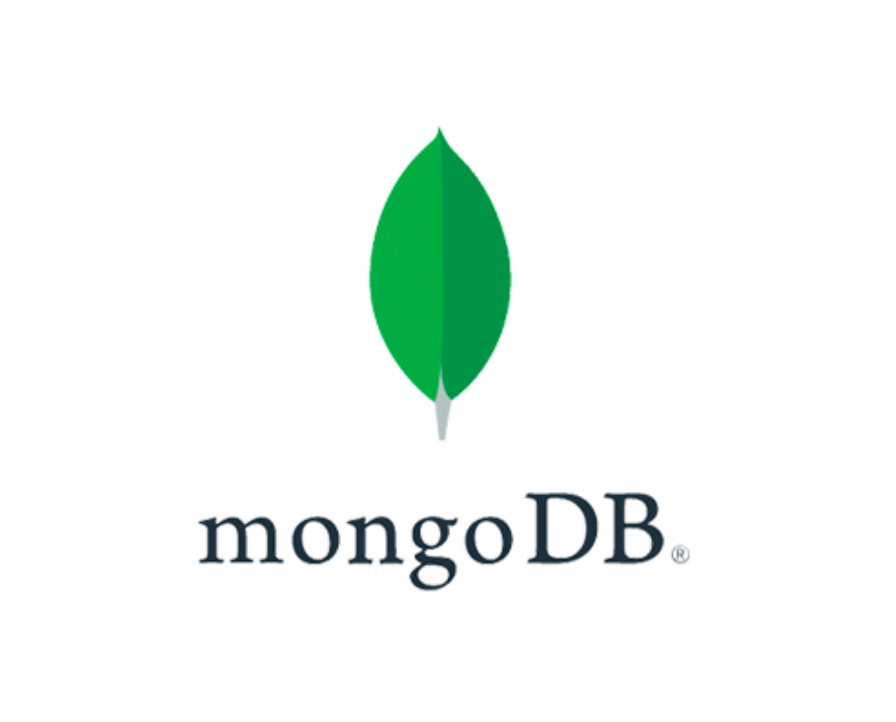

<div align="center">
  
  <h2>
   Proyect Diaconia Taller API by Enrique Tarqui
  </h2>
</div>

<div align="center">
    <a href="https://github.com/yourusername/user-management-system/blob/main/LICENSE">
        
    </a>
    <a href="https://github.com/yourusername/user-management-system/releases">
        
    </a>
    <a href="https://github.com/yourusername/user-management-system/issues">
        
    </a>
    <a href="https://github.com/yourusername/user-management-system/graphs/contributors">
        
    </a>
</div>

<div align="center">
  User management system with JWT authentication for managing users and their roles with a CRUD interface. Built with Java, Spring Boot, and Swagger documentation for API endpoints.
</div>
<div align="center"><b>
<h4>See the <a href="https://gitlab.com/groups/jala-university1/cohort-3/oficial-es-desarrollo-de-software-3-cssd-232.ga.t1.25.m2/secci-n-d/digitalgangters/-/wikis/home">docs</a> for more info.</h4>
</b>
</div>

<br>
<br>

<div align="center">
<h2>
🔐 About the Project</h2>

  <p>
    This project provides a secure User Management System that supports JWT-based authentication and allows administrators to perform CRUD operations on users. It also includes Swagger documentation for API endpoints, making it easy to integrate and test the system. This system is built using Java and Spring Boot for the backend and utilizes JWT for authentication.
  </p>
</div>

<br>
<br>

<div align="center">
  <h2>🚀 Features</h2>
  <ul align="left">
    <li>🔐 JWT-based authentication for secure access.</li>
    <li>👤 CRUD operations for managing users and their roles.</li>
    <li>📊 API documentation using Swagger for easy access to endpoints.</li>
    <li>🔧 Admin interface for managing user data, roles, and permissions.</li>
    <li>🛠 Simple setup for development and production environments.</li>
  </ul>
</div>

<br>
<br>

<div align="center">
<h2>
🤝 Contributing
</h2>
</div>

We welcome contributions to the User Management System! Please fork the repository, create a feature branch, and submit a pull request with your improvements. Be sure to follow the guidelines in our [contribution documentation](/contributing.md).

<br>
<br>

<div align="center">
<h2>
License 📜
</h2>
</div>

This project is licensed under the MIT License - see the [LICENSE](/licence.md) file for details.

<br>
<br>

<div align="center">
<h2>
Technologies Used 🔧
</h2>
</div>

<div style="display: grid; grid-template-columns: repeat(auto-fill, minmax(100px, 1fr)); gap: 10px; justify-items: center;" align="center">
  
  
  
  
  
  
  
</div>

<br>
<br>

<div align="center">
<h2>
SetUp 💻🔌
</h2>
</div>

### 1. Clone the repository:

 ```bash
   git clone https://github.com/MashiXplore/proyect-diaconia-taller-api.git

 ```

 ### 2. Open the project in your IDE, and execuete the following command:

```bash
mvn clean install
```

If u have any problem with the dependencies, please visit the: [Project Setup and Dependencies](https://gitlab.com/groups/jala-university1/cohort-3/oficial-es-desarrollo-de-software-3-cssd-232.ga.t1.25.m2/secci-n-d/digitalgangters/-/wikis/home/ProjectsSetup/ProjectsSetupSpring) section in the project wiki for details about the versions of dependencies used.


and then enjoy the project!